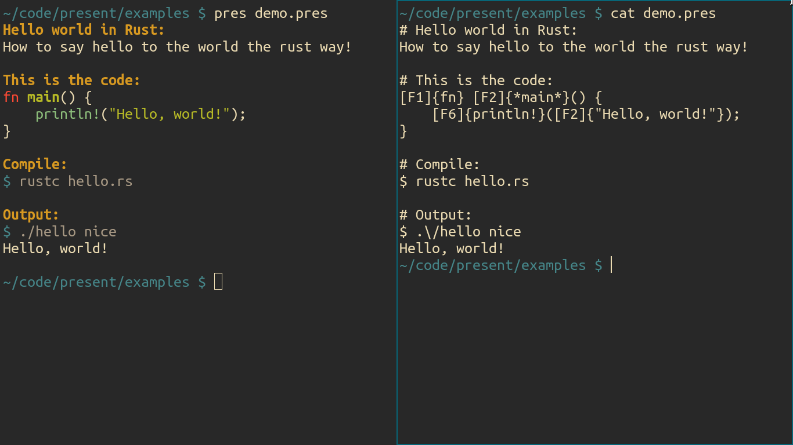

# Presenter


This is the result of me messing around with the GNU coreutils in the command line. It is a ***very*** dumb text processor.

## Usage
```console
$ pres [FILE] [...]
```

## Syntax
The syntax of `pres` is *really* simple, considering it is the stupidest text processor in existence.

### Basic
- Headings are started with a `#` at the ***start*** of the line. (No whitespace allowed!)

- List items are started with a `-` at the start of the line. Same whitespace rule as headings.

### Text styles
- **bold** text is written as `*TEXT*`.
- *italic* text is written as `/TEXT/`.
- <ins>underlined</ins> text is written as `_TEXT_`.
- ~~strike through~~ text is written as `=TEXT=`.

### Colors
This is the syntax for colors in `pres`.

```
[<TYPE><NUMBER>]{<TEXT>}
```

The three syntax elements are discussed below.

# `<TYPE>`
The type of color to apply.

| Character | Description |
| --------- | ----------- |
| `f` | foreground color |
| `F` | bright foreground color |
| `b` | background color |
| `B` | bright background color |

# `<NUMBER>`
A number between `0-7` which denotes the color according to [ANSI](https://en.wikipedia.org/wiki/ANSI_escape_code):

| Number | Color |
| ------ | ----- |
| `0` | black |
| `1` | red |
| `2` | green |
| `3` | yellow |
| `4` | blue |
| `5` | magenta |
| `6` | cyan |
| `7` | white |

# `<TEXT>`
The text, duh.

## Requirements
- `sh`
- `cat`
- `tr`
- `sed`

## Vim
Move the `pres.vim` file into the syntax directory of Vim. Here are some copy-pasta commands.

```sh
# Vim
mv pres.vim ~/.vim/syntax

# Neovim
mv pres.vim ~/.config/nvim/syntax
```

To activate the syntax for any file, just set the filetype to `pres`.
```vim
:set ft=pres
```

Here's a quick autocommand for recognizing `*.pres` files as pres files.

```vim
autocmd BufRead,BufNewFile *.pres setlocal filetype=pres
```
